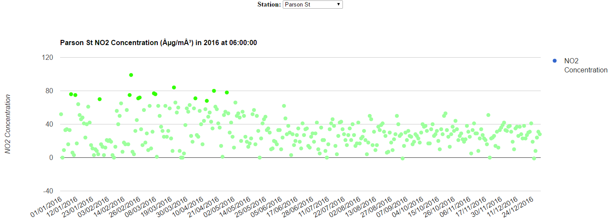
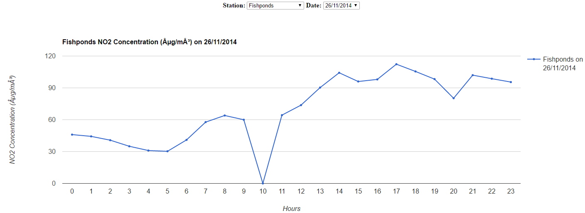
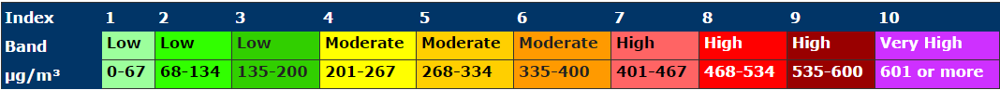
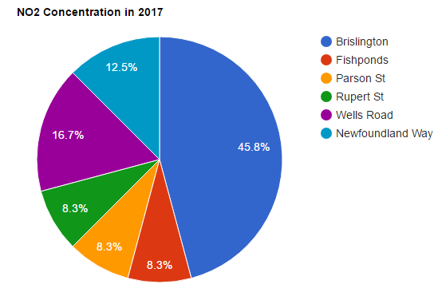
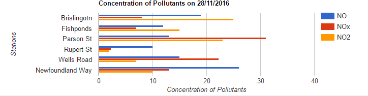

# Advanced Topics in Web Development 2
## 1.0 Links to Source Files

| Source Files    | Links                                   | 
| :-------------  | :-------------                          |
| CSV to XML      | [csvToXML.php](http://www.cems.uwe.ac.uk/~s5-low/atwd2/assignment/csvToXML.php)            |
| Normalise Data  | [normaliseData.php](http://www.cems.uwe.ac.uk/~s5-low/atwd2/assignment/normaliseData.php)  |
| Scatter Graph   | [scatterChart.php](http://www.cems.uwe.ac.uk/~s5-low/atwd2/assignment/scatterChart.php)    |
| Line Graph      | [lineChart.php](http://www.cems.uwe.ac.uk/~s5-low/atwd2/assignment/lineChart.php)          |

## 2.0 Normalise and Optimise the Data

`DOM parser` is a processing model that create an object tree in the memory where it loads everything from the file into the memory. Once it is loaded in the memory, the object can navigate freely to any node. Also, since the data is stored in the memory, the object can append, delete or update a child node. But this processing model requires large memory space as the memory holds the entire representation of the document as an object when it starts to process the document. Therefore, DOM parser is only good to parse smaller size data but the assignment requires parsing large XML files. So, this makes DOM parser not a good choice to implement in this assignment. 

`Stream parser (SAX)` is perfect for situation when handling large amount of data. It is more efficient in a way the overall performance can be better than the DOM parser when parsing big data because SAX parses data as a stream where it reads the XML file line by line. It uses event-pattern to transmit and parse data serially by defining a handler class that takes in value from the elements or attributes. Also, SAX is capable of processing the output immediately and the collection of elements can be discarded immediately after they are used. Therefore, it will not keep any data in the memory and that explains SAX can be relatively fast compared to DOM parser. Since it provides higher performance, the drawback of this model is not able to access multiple documents at the same time because it cannot navigate an XML document. Therefore, it is better to know what data is needed before parsing data from the XML file. 

In this assignment, stream parser is more suitable to parse the data from XML file as it only requires to read the XML file and does not need to modify the data. So, there is no need to worry on the memory consumption as SAX does not need much memory space. DOM parser is not suitable to parse data from the XML file as it has large data. Thus, it will be expensive to load the file into the memory as the case only needs some of the data from the XML file. Code snippet below shows the implementation of using `Stream Parser (SAX)` to normalise data for each XML files in [normaliseData.php](http://www.cems.uwe.ac.uk/~s5-low/atwd2/assignment/normaliseData.php). The `XMLReader()` is used to move the cursor forward from the beginning of the document and stop at the end of the document within a while loop. 

```php

$loc=array("Brislington","fishponds","parson st","rupert st","wells road","newfoundland way")
$reader = new XMLReader();
$filename = str_replace(' ' , '_', $loc[$i]);
$file_name = strtolower($filename).'.xml';
$records=array();

    #if the reader failed to open the file
    if (!$reader->open($file_name)) {
        die("Failed to open 'data.xml'");
    }
    #reader reading the file line by line
    while($reader->read()) {
        if ($reader->nodeType == XMLReader::ELEMENT){
            switch($reader->name){#read the attributes where the cursor is pointing
                case "row":
                    $row=array(); #Array that stores all the attributes needed for each row
                    $row['count'] = $reader->getAttribute('count');
                    break;
                        
                case "desc":
                    $row['desc'] = $reader->getAttribute('val');
                    break;
                        
                case "date":
                    $row['date'] = $reader->getAttribute('val');
                    break;
                    
                case "time":
                    $row['time'] = $reader->getAttribute('val');
                    break;
                        
                case "no2":
                    $row['no2'] = $reader->getAttribute('val');
                    break;
                        
                case "lat":
                #if the $lat field is empty then store the value, to reduce redundancy
                    if(!isset($lat)){
                        $row['lat'] = $reader->getAttribute('val');
                    }
                    break;
                        
                case "long":
                    if(!isset($long)){
                        $row['long'] = $reader->getAttribute('val');
                        $records[]=$row; #array that stores all the rows
                    }
                    break;
            }
        }
    }
```


## 3.0 Extensibility of Charting and Data Visualisation

Google Charts is a visualisation API which used to visualise the required data from 6 XML files and produced,

+ [scatterChart.php](http://www.cems.uwe.ac.uk/~s5-low/atwd2/assignment/scatterChart.php)    
+ [lineChart.php](http://www.cems.uwe.ac.uk/~s5-low/atwd2/assignment/lineChart.php)          

In `Scatter Chart`, it is generated by taking in a specific date and time which are not selectable by the user but user gets to choose the stations that available from the drop down list to generate the chart. Code Snippet below extracted from [scatterChart.php](http://www.cems.uwe.ac.uk/~s5-low/atwd2/assignment/scatterChart.php) shows the Scatter Chart present the concentration of NO2 in 2016 at 6:00:00 at Parson St.
```javascript

    #Scatter Chart
    var data = google.visualization.arrayToDataTable([
    ['Dates', 'NO2 Concentration',{'type':'string','role':'style'}],
        <?php
                
            echo "['" . $reading['date'] . "'," . $reading['no2'] . "],";
        }
        ?>
    ]);
```


In `Line Chart`, user can choose which station and date to generate the chart. Code Snippet below [lineChart.php](http://www.cems.uwe.ac.uk/~s5-low/atwd2/assignment/lineChart.php) shows the chart will present the concentration of NO2 in a day that user selects. 
```javascript

    #Line Chart
    var data = new google.visualization.DataTable();
    data.addColumn('string', 'X');
    data.addColumn('number', '<?php echo $_POST['stations']." on ". $_POST['date'] ;?>');
            
    data.addRows([
        <?php 
            for($hour=0;$hour<24;$hour++){
                $no2ByHour[$hour] = countAverage($records, $hour);
            } 
        ?>
    ]);
```
    

`Data visualisation` is to present the data in a **pictorial or graphical format** where the main purpose is actually to allow user visual access to a huge amount of data in an understandable visual. Thus, a well designed data charts has to be simple and at the same time be relevant to the research area. In order to improve the charts to be more understandable, indicators with different colours will represent the index value of the Nitrogen Oxide Concentration, these indicators will be used to populate the data. Hence, user will understand the pollution level straight away by looking at the indicators. The figure below extracted from [scatterChart.php](http://www.cems.uwe.ac.uk/~s5-low/atwd2/assignment/scatterChart.php) shows the colour encoding and the levels for the concentration of NO2 in the air, averaged over a period of one hour.

 

```php

    $color = '';           
    foreach ($records as $reading) {
        if($reading['no2']>=0 && $reading['no2'] <68){
            $color = 'rgb(156,255,156)';
        }else if($reading['no2']>=68 && $reading['no2'] <135){
            $color = 'rgb(49,255,0)';
        }else if($reading['no2']>=135 && $reading['no2'] <201){
            $color = 'rgb(49, 207, 0)';
        }else if($reading['no2']>=201 && $reading['no2'] <268){
            $color = 'rgb(255, 255, 0)';
        }else if($reading['no2']>=268 && $reading['no2'] <335){
            $color = 'rgb(255, 207, 0)';
        }else if($reading['no2']>=335 && $reading['no2'] <401){
            $color = 'rgb(255, 154, 0)';
        }else if($reading['no2']>=401 && $reading['no2'] <468){
            $color = 'rgb(255, 100, 100)';
        }else if($reading['no2']>=468 && $reading['no2'] <535){
            $color = 'rgb(255, 0, 0)';
        }else if($reading['no2']>=535 && $reading['no2'] <601){
            $color = 'rgb(153, 0, 0)';
        }else if($reading['no2']>=601){
            $color = 'rgb(206, 48, 255)';
        }
        echo "['" . $reading['date'] . "'," . $reading['no2'] . ",'point{fill-color:". $color .";}'],";
    }
```
In this assignment, the `concentration of Nitrogen Oxide, NO2 in the air at 6 different stations` are the variables to populate a graph in order to measure the overall air quality. Scatter chart and line chart are used to present the air quality at 6 different stations. But, if user needed a quick overview of the concentration of the pollutant in the air at each stations in a specific year, Pie Chart would be the most suitable to represent the data. Pie Chart below represents the average of NO2 concentration at each stations in a year.

 

In the Scatter and Line Chart, both take in station and date/time to generate the graph showing the concentration of Nitrogen Oxide (NO2) in the air. Nitrogen Oxide (NO2) is not the only factor that caused air pollution, so the graph may consider other pollutants as a factor that affect the air quality. For example, Carbon dioxide should be also taken into consideration as one of the variable that affect the air quality in the air. As most of the air pollutions are caused by Carbon Dioxide (CO2), so the concentration of Carbon Dioxide (CO2) in the air may be a good indicator to measure the air quality. Hence, measuring the concentration of other pollutants may populate the level of air quality at each stations more precise as it may help the user to realise which pollutants has the most and the least affect to the air pollution. Knowing which pollutant has the most impact to the air quality may help to increase the air quality at each stations. Bar Chart below represents the concentration of each pollutants in the air at each stations on a specific date. 



## 4.0 Referencing

Miguélez, F. (2017) Best XML parser for Java. Available from: http://stackoverflow.com/questions/373833/best-xml-parser-for-java?rq=1 [Accessed 22 March 2017].

OldCurmudgeon, O. (2017) Java: Parsing XML files: DOM, SAX or StAX?. Available from: http://stackoverflow.com/questions/21019509/java-parsing-xml-files-dom-sax-or-stax [Accessed 22 March 2017].

Sanaulla, M. (2017) Parsing XML using DOM, SAX and StAX Parser in Java. Available from: https://www.javacodegeeks.com/2013/05/parsing-xml-using-dom-sax-and-stax-parser-in-java.html [Accessed 22 March 2017].

sparkymat, s. (2017) What is the difference between SAX and DOM?. Available from: http://stackoverflow.com/questions/6828703/what-is-the-difference-between-sax-and-dom [Accessed 22 March 2017].

The Java, T. (2017) Why StAX?. Available from: http://docs.oracle.com/cd/E17802_01/webservices/webservices/docs/1.6/tutorial/doc/SJSXP2.html [Accessed 22 March 2017].
